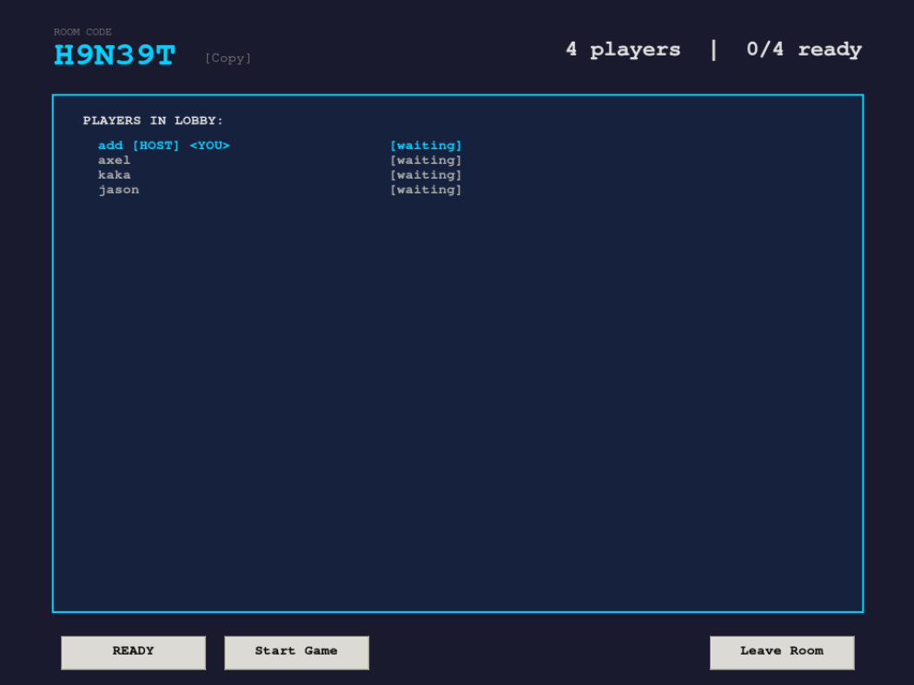
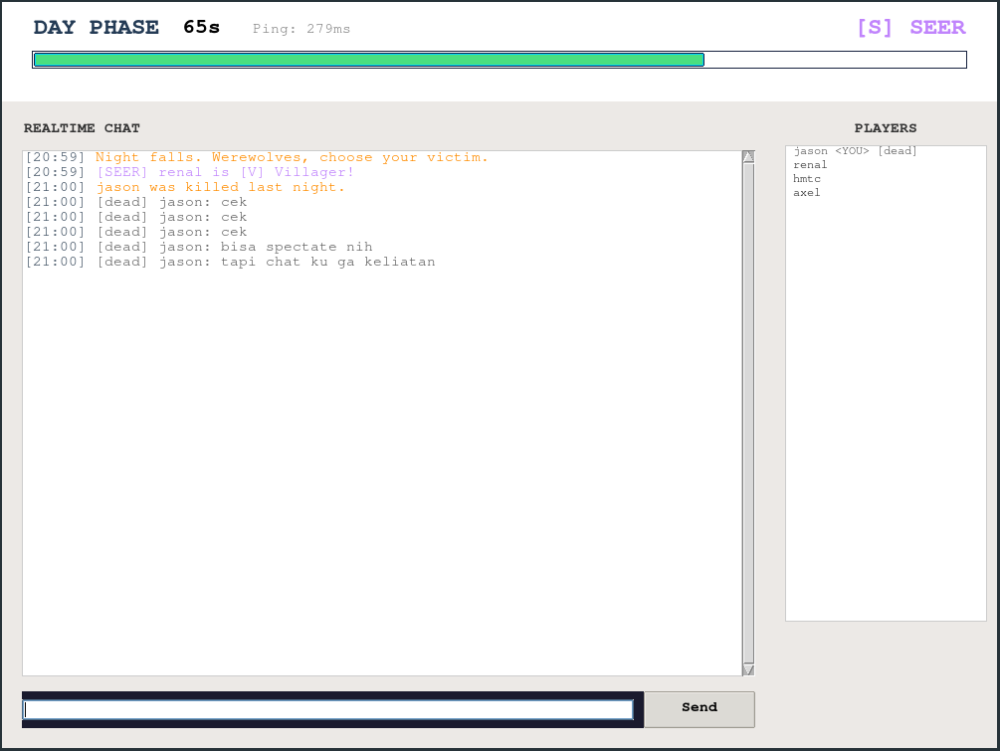
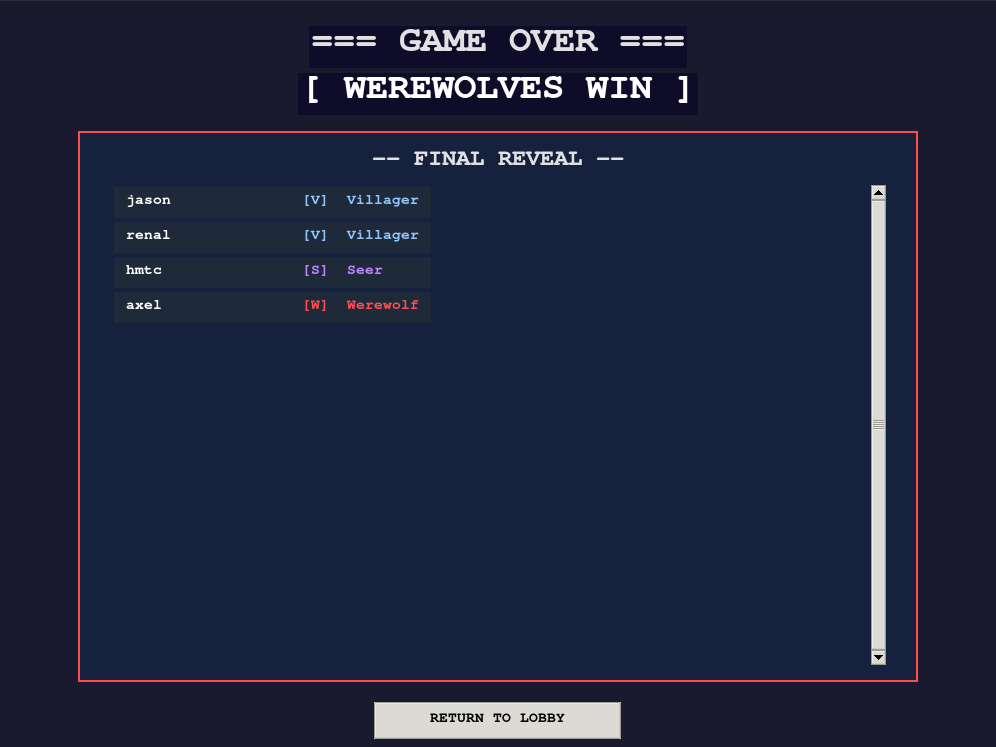
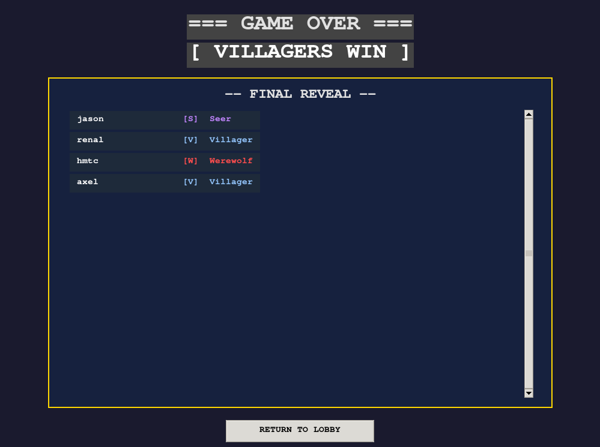

[](https://classroom.github.com/a/90Mprfp5)
# Network Programming - Final Project [G04]

## Anggota Kelompok
| Nama | NRP | Kelas |
|------|-----|-------|
| Ahmad Loka Arziki | 5025241044 | C |
| Jason Kumarkono | 5025241105 | C |
| Christian Mikaxelo | 5025241178 | C |

## Link Youtube (Unlisted)
Link ditaruh di bawah ini

[LINK VIDEO](https://youtu.be/RKmR_TkFjoM)


## Penjelasan Program

Werewolf: Azrael of the Night adalah game multiplayer berbasis jaringan yang mengimplementasikan permainan Werewolf (Mafia). Dibangun dari scratch menggunakan **TCP socket Python** tanpa framework backend apapun.

Setiap pemain mendapat role rahasia dan bersaing dalam dua kubu: **Werewolf** yang berusaha mengeliminasi pemain lain tanpa ketahuan, dan **Villager** yang berusaha mengidentifikasi dan mengeliminasi semua Werewolf melalui diskusi dan voting. Seluruh logika permainan dijalankan secara terpusat di server sehingga client tidak bisa memanipulasi state secara langsung.

### Arsitektur Sistem


```
Client (Tkinter GUI)
    |
    | TCP port 5000, JSON + newline
    |
Server (Python TCP, DigitalOcean)
    |-- PacketHandler  (game logic)
    |-- RoomManager    (room management)
    |-- GameState      (state per room)
    +-- SQLite DB      (auth + sessions)
```

### Struktur Project

```
|-- server.py                  # TCP server, accept loop, per-client threads
|-- client.py                  # Tkinter GUI client
|-- game/
|   |-- game_state.py          # Phase/Role enum, GameState, win logic
|   |-- player.py              # Player model
|   |-- room_manager.py        # Room CRUD, host reassign, locking
|   +-- packet_handler.py      # Semua game logic dan protocol handler
|-- server/
|   +-- database.py            # SQLite: users + sessions
|-- utils/
|   |-- serializer.py          # encode/decode JSON packet
|   +-- validators.py          # Schema validation per packet type
|-- tools/
|   +-- load_test.py           # Load testing script
+-- log_server.py              # HTTP server untuk akses log dari luar
```

### Cara Main

Kebutuhan: Python 3.10+ dan koneksi internet. Server sudah deploy di cloud, gak perlu setup apapun di sisi server.

```bash
# Clone repo
git clone https://github.com/nafkhanzam-classrooms/g04-final-project-c-10_werewolfgame.git
cd g04-final-project-c-10_werewolfgame

# Jalankan client
python3 client.py
```

Gak perlu install library tambahan, semua pakai standard library Python. Client langsung connect ke `143.198.217.44:5000` secara otomatis.

### Flow Game

.png>)

1. **Register / Login:** buat akun atau login dengan akun yang sudah ada
2. **Lobby:** buat room baru atau join room dengan kode 6 karakter
3. **Room Lobby:** tunggu pemain lain, semua harus ready (minimal 4 pemain)
4. **Host klik Start:** role dibagikan secara acak dan rahasia
5. **Malam (45s):** Werewolf pilih korban, Seer investigasi, Guard lindungi
6. **Siang (90s):** diskusi terbuka, cari siapa serigalanya
7. **Voting (45s):** semua vote siapa yang dieliminasi
8. **Ulangi** sampai salah satu tim menang

### Skala Role

| Pemain | Werewolf | Role Spesial |
|--------|----------|--------------|
| 4-5 | 1 | Seer |
| 6-7 | 2 | Seer, Guard |
| 8-10 | 2 | Seer, Guard, Hunter |
| 11-15 | 3 | Seer, Guard, Hunter |

### Desain Protokol

Semua komunikasi pakai **line-delimited JSON over TCP**:

```json
{"type": "login", "username": "alice", "password": "secret"}\n
```

Setiap pesan diakhiri `\n` sebagai pemisah karena TCP adalah byte stream. Tanpa delimiter, server gak bisa tahu kapan satu pesan berakhir dan pesan berikutnya mulai. Kedua sisi (client dan server) pakai buffer yang sama untuk handle fragmentasi:

```python
buffer += data.decode("utf-8")
while "\n" in buffer:
    line, buffer = buffer.split("\n", 1)
    packet = json.loads(line)
    # proses packet...
```

#### Packet Client ke Server

| Type | Field | Keterangan |
|------|-------|------------|
| `register` | `username`, `password` | Daftar akun baru |
| `login` | `username`, `password` | Login |
| `create` | `room` | Buat room baru |
| `join` | `room` | Masuk room |
| `ready` | `status` | Toggle ready |
| `start` | - | Host mulai game |
| `chat` | `msg` | Kirim pesan |
| `kill` | `target` | Werewolf bunuh target |
| `protect` | `target` | Guard lindungi target |
| `check` | `target` | Seer cek identitas |
| `vote` | `target` | Vote eliminasi |
| `cancel_action` | - | Batalkan aksi malam/vote |
| `hunter_shot` | `target` | Hunter balas dendam |
| `ping` | `t` | Heartbeat / RTT |

#### Packet Server ke Client

| Type | Keterangan |
|------|------------|
| `login_ok` | Auth berhasil |
| `room_joined` | Berhasil masuk room |
| `players_list` | Update daftar pemain |
| `phase_change` | Transisi fase game |
| `role_assigned` | Kasih tahu role pemain |
| `wolf_team` | Kasih tahu siapa tim serigala |
| `timer` | Countdown tiap detik |
| `chat` | Pesan chat |
| `seer_result` | Hasil investigasi Seer |
| `vote_update` | Update tally vote |
| `eliminated` | Pengumuman eliminasi |
| `hunter_prompt` | Minta Hunter pilih target |
| `game_over` | Game selesai, reveal semua role |
| `state_snapshot` | Sync state saat reconnect |
| `pong` | Respon ping |
| `error` | Pesan error |

### Concurrency Model

Server pakai **one thread per client**:

```
Main thread          -> accept() loop
Watchdog thread      -> cek ping timeout tiap 5 detik
Handler thread x N   -> recv, parse, dispatch per client
Timer thread x M     -> countdown tiap fase game
```

Shared state dilindungi dengan dua level lock:

```python
RoomManager._mgr_lock   # proteksi dict rooms
Room.lock               # proteksi state game per room
```

### Fitur Utama

**Reconnect Handling:** kalau koneksi putus di tengah game, slot pemain tetap tersimpan. Server menyimpan session di SQLite dengan room_code yang masih ada. Login lagi dan langsung balik ke game tanpa kehilangan role, server mengirimkan `state_snapshot` berisi phase saat ini, sisa waktu, dan daftar pemain.

**Anti-Invalid Packet:** server validasi semua packet sebelum diproses pakai schema validator. Packet aneh langsung ditolak dengan error response, koneksi tetap hidup.

```python
ok, err = validate_packet(packet)
if not ok:
    self.send(player, {"type": "error", "msg": err})
    return
```

**Cancel Action:** pemain bisa batalkan pilihan malam atau vote dengan klik tombol yang sama lagi. Server langsung hapus aksi yang sudah tercatat.

**Phase Timer:** timer tiap fase jalan di server, bukan di client. Timer bar di UI berubah warna, hijau ke kuning ke merah sesuai sisa waktu.

**Server Logging:** setiap aktivitas player (connect, login, disconnect, reconnect) dicatat ke file log dengan timestamp. Log bisa diakses dari luar server via HTTP endpoint tanpa perlu SSH.

**CI/CD:** setiap push ke branch `main` otomatis deploy ke DigitalOcean Droplet via GitHub Actions.

### Deployment

Server di-deploy di **DigitalOcean Droplet** (Ubuntu 24.04) sebagai systemd service dan auto-restart kalau crash.

```bash
# Cek log server dari mana saja
curl http://143.198.217.44:5001/logs/latest

# List semua log file
curl http://143.198.217.44:5001/logs
```

### Load Test

```bash
python3 tools/load_test.py --clients 100
```

Hasil load test terhadap server DigitalOcean Droplet:

| Clients | Success | Avg Login Latency | Avg Ping RTT |
|---------|---------|-------------------|--------------|
| 50 | 50/50 (100%) | 2545.7 ms | 181.0 ms |
| 100 | 100/100 (100%) | 1292.6 ms | 104.5 ms |
| 500 (sebelum fix) | 173/500 (34.6%) | 1743.8 ms | 151.6 ms |
| 500 (sesudah fix) | 500/500 (100%) | 3005.0 ms | 472.8 ms |

Server stabil hingga 100 concurrent client dengan success rate 100%. Pada 500 client, bottleneck awal disebabkan file descriptor limit OS (default 1024) dan SQLite writer starvation. Keduanya diselesaikan dengan menaikkan `LimitNOFILE` di systemd dan mengaktifkan WAL mode pada SQLite.

### Known Limitations

- **Hunter timeout:** timer 20 detik Hunter pakai `time.sleep()`, tidak bisa di-cancel dari luar
- **Vote tie:** kalau vote seri, tidak ada yang dieliminasi dan ronde bisa berulang
- **SQLite concurrency:** koneksi baru per query, tidak pakai connection pool
- **SQLite WAL mode:** setelah fix, error "database is locked" berkurang drastis tapi masih bisa muncul pada beban sangat tinggi (>500 concurrent writes)
- **No encryption:** komunikasi client-server tidak dienkripsi (TLS/SSL belum diimplementasi)

## Screenshot Hasil

### 1. Lobby Room
> 
*Menampilkan daftar pemain, status Ready/Unready*

### 2. Night Phase (Werewolf View)
> 
*Aksi Werewolf memilih mangsa dalam chat khusus Werewolf.*

### 3. Night Phase (Seer Action)
> 
*Tampilan hasil pengecekan peran (Villager/Werewolf) yang muncul secara privat di chat Seer.*

### 4. Day Phase
> 
*Diskusi terbuka antar pemain untuk mencari Werewolf.*

### 5. Voting Phase
> 
*Proses pemungutan suara untuk menyingkirkan tersangka.*

### 6. Dead Chat Channel
> 
*Pemain yang sudah mati tetap bisa memantau game*

### 7. Game Over (Winner Reveal)
> 
> 
*Pengumuman pemenang (Villagers/Werewolf Win)*